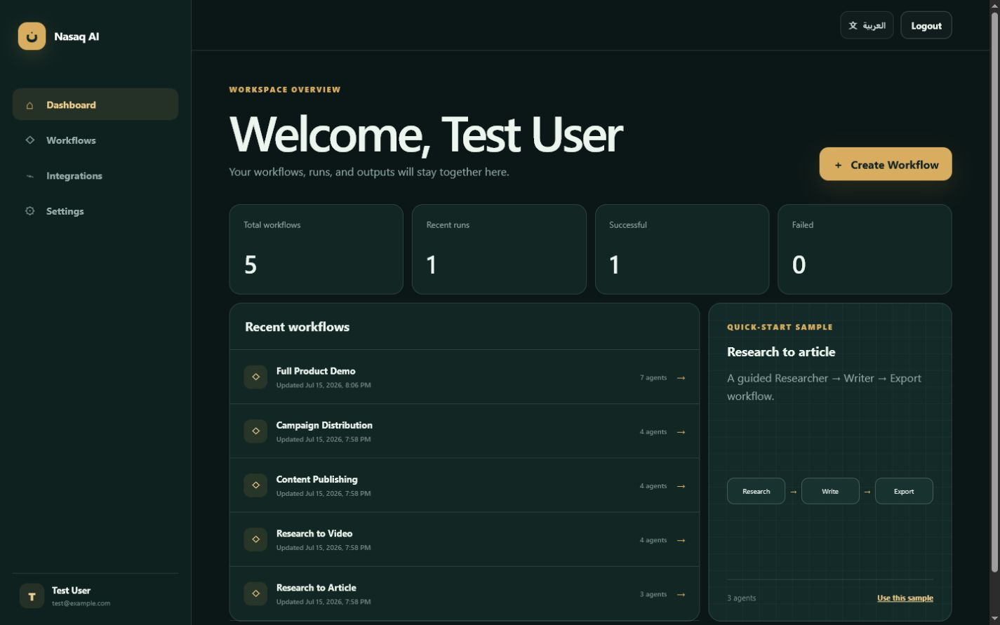
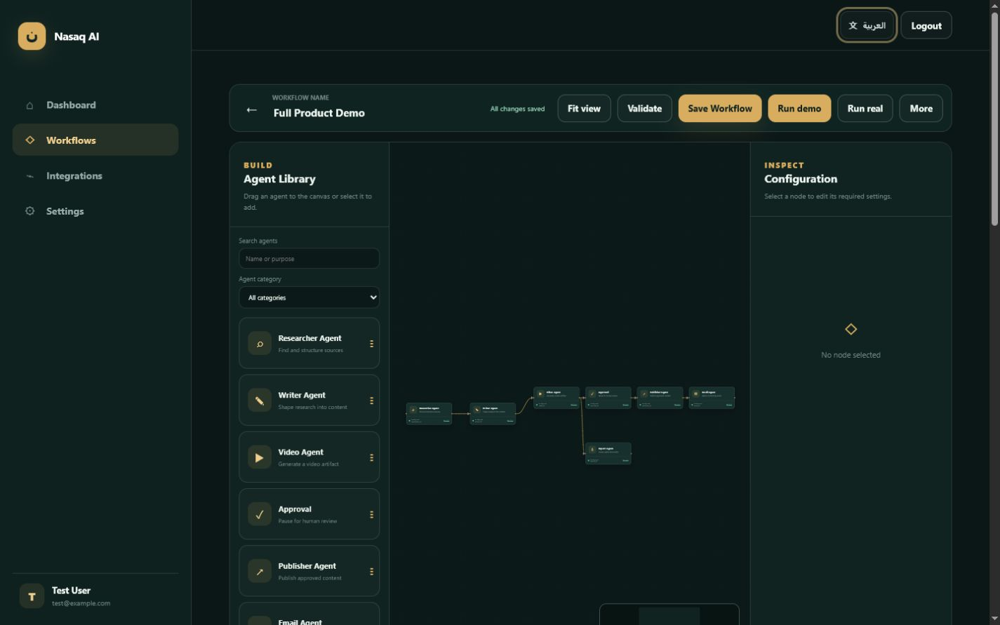
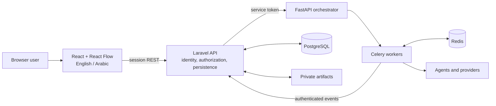
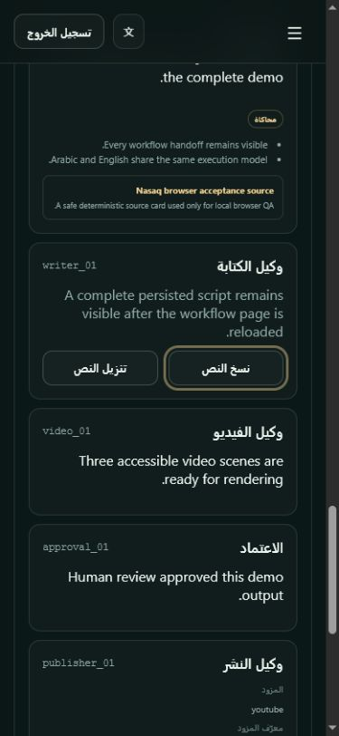

# Nasaq AI / نسق

> Orchestrate Intelligence. Automate Creation.  
> نسّق الذكاء. أتمت الإبداع.

Nasaq AI is a working bilingual visual AI-agent workflow platform. A user can
build a directed workflow on a React Flow canvas, configure specialized agents,
run it asynchronously through Laravel, FastAPI, Celery, and Redis, review human
approval steps, and download or distribute durable outputs.



## What works

- Registration, Sanctum session login/logout, role-based access control (`user` / `admin`), account status suspension guards, persisted English/Arabic locale, responsive layout, keyboard focus, skip link, and RTL.
- Dedicated Admin Layout (`AdminLayout.jsx`) with sidebar, mobile navigation, breadcrumbs, LTR/RTL language switcher, administrator profile menu, and rate-limited sub-routes (`/admin/overview`, `/admin/users`, `/admin/providers`, `/admin/runs`, `/admin/system`, `/admin/audit-logs`) rendering real DB-calculated metrics (`runs_today`, `success_rate`, user/workflow aggregates).
- Secure platform API credential management (`platform_integrations`, `integration_audit_logs`) allowing administrators to add, update, test, enable, disable, and remove encrypted provider credentials (`openai`, `gemini`, `tavily`, `serpapi`, `youtube`, `google_drive`, `gmail`, `smtp`, `tts`) with password confirmation and masked key responses.
- Provider-neutral LLM architecture (`BaseLLMProvider`, `OpenAIProvider`, `GeminiProvider`, `ProviderFactory`, `NormalizedLLMResponse`) with database-backed platform default selection (`ai_provider_configurations`) and model assignment controls (`gpt-4o` vs `gemini-1.5-flash`).
- Owned workflow CRUD, exact graph reload, copyable templates, drag/add,
  compatible connections, configuration, validation, save, and run controls.
- Researcher, Writer, Video, Approval, Publisher, Email, and Export agents.
- Deterministic demo mode and credential-backed real provider mode.
- FastAPI submission to Celery/Redis, retries, cooperative cancellation, durable
  Laravel callbacks, per-node status, logs, outputs, and correlation IDs.
- Real Markdown, PDF, DOCX, and H.264 MP4 artifacts in private authorized storage.
- Encrypted Google Drive, YouTube, and SMTP settings with simulated safe demos,
  idempotent side effects, and owner-only access.



## Architecture



Laravel is the only public data/API boundary and owns identity, policies, runs,
logs, approvals, and output metadata. FastAPI validates immutable snapshots and
submits Celery tasks. Workers execute the academic report's agentic pipeline and
report idempotent events back to Laravel. See [architecture](docs/architecture.md),
[API contracts](docs/api-contracts.md), and [agent contracts](docs/agent-contracts.md).

## Clean local start

Prerequisite: Docker Desktop or Docker Engine with Compose v2.

```bash
git clone <repository-url> nasaq-ai
cd nasaq-ai
cp .env.example .env
docker compose up --build --detach
```

The Laravel container migrates the database on startup. Open
`http://localhost:5173`, register an account, and create a workflow. Health:

- Frontend: `http://localhost:5173/health`
- Laravel: `http://localhost:8000/api/health`
- FastAPI: `http://localhost:8001/health`

To promote a user to administrator or create a new administrator account:

```bash
docker compose exec laravel php artisan nasaq:make-admin admin@example.com
```

For a controlled evaluation fixture:

```bash
docker compose exec laravel php artisan db:seed --class=BrowserAcceptanceSeeder --force
```

- Email: `test@example.com`
- Password: `NasaqDemo2026`

This fixture resets that demo account and must not be run against a real user's
email. It creates five editable templates and one persisted successful full demo.

## Verification

Windows, including project-local runtimes and every cumulative gate:

```powershell
powershell -ExecutionPolicy Bypass -File .\infrastructure\scripts\test-all.ps1
```

Native-only preflight:

```powershell
powershell -ExecutionPolicy Bypass -File .\infrastructure\scripts\test-all.ps1 -SkipDocker
```

macOS/Linux/Git Bash component wrapper:

```bash
./infrastructure/scripts/test-all.sh
```

The final gate covers frontend lint/tests/build, Python lint/format/tests,
Laravel formatting/tests, clean offline dependency resolution, a disposable
fresh database, production configuration, live PostgreSQL/Redis services, and
the complete Laravel → FastAPI → Celery → callback workflow. Details are in
[testing](docs/testing.md) and evidence status is in
[PROJECT_STATUS.md](PROJECT_STATUS.md).

## Production-style deployment

Use `.env.production.example`, `docker-compose.prod.yml`, and the complete
[deployment guide](docs/deployment.md). Only the Nginx gateway publishes a host
port; PostgreSQL, Redis, FastAPI, and the worker remain private. TLS terminates
at the platform/host proxy, Redis is authenticated, and secrets have no usable
defaults.

Real Search/LLM/TTS runs require server-side provider keys. Drive, YouTube, and
SMTP connections are entered in **Integrations**, encrypted at rest, never
returned to the browser, and retrieved by the worker over an internal protected
endpoint. Provider calls and delivery may cost money.

## Final demo and screenshots

The repeatable core, Arabic, full-product, and failure/recovery walkthroughs are
in [final demonstration scenarios](docs/final-demo.md).



Additional captures are in [docs/screenshots](docs/screenshots/README.md).

## Repository layout

```text
frontend/             React/Vite application and visual editor
backend-laravel/      Public API, authorization, persistence, and artifacts
ai-service-python/    FastAPI, Celery, agents, providers, and media generation
docs/                 Architecture, contracts, deployment, testing, and demos
infrastructure/       Reverse proxy and cumulative verification scripts
```

## Limitations

- Normal automated tests use demo providers and exact mocked real-provider
  contracts; paid APIs and actual external delivery require valid user-supplied
  credentials and an explicit opt-in test.
- The bundled Laravel container uses the CLI server for portable single-host
  deployment. High-throughput production should use a managed PHP runtime.
- Artifact storage is a local persistent volume. Multi-host deployment requires
  a shared object-storage disk and matching backup policy.
- Video narration depends on configured TTS credentials; silent video remains a
  real FFmpeg-generated MP4.
- Provider OAuth refresh, quotas, consent screens, and policy reviews remain the
  deployment owner's operational responsibility.

## Source of truth

The May 2026 Milestone 2 report, *A Visual AI-Agent Workflow Platform for
End-to-End Content Automation*, is the academic source of truth. The Master
Build Specification supplies implementation details, phase gates, and the final
Definition of Done. PostgreSQL JSONB is the documented implementation choice for
flexible workflow/output data in place of the report's optional MongoDB store.
