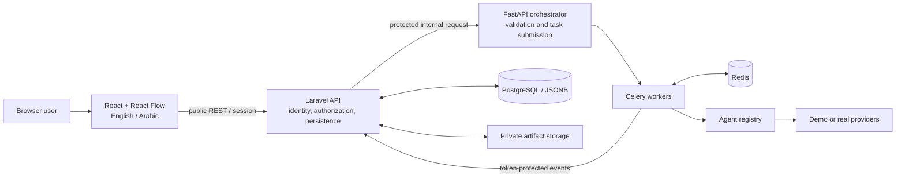
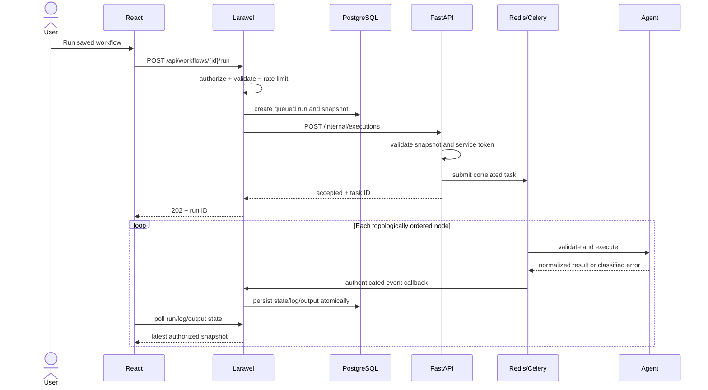

# Architecture

## Decision summary

Nasaq AI preserves the report's three conceptual layers while adding Laravel as
the product/application boundary required by the implementation specification.

### Layer mapping to the report

1. **User and Interface Layer:** React, React Flow, i18n, safe previews.
2. **Backend Orchestration Layer:** FastAPI, DAG validation, topological sort,
   Celery, Redis, execution state. Laravel sits in front as the public MVC/API
   and data owner; it does not replace the report's Python orchestration.
3. **Agentic Execution Layer:** modular agents, provider interfaces, file/video
   services, and external APIs.

## Service ownership

| Concern | Owner | Reason |
|---|---|---|
| Authentication, sessions, profiles | Laravel | Mature security and policy boundary |
| Workflow CRUD and ownership | Laravel | One source of truth for user data |
| Runs, logs, approvals, outputs | Laravel/PostgreSQL | Durable UI-visible state and authorization |
| Workflow validation/execution | FastAPI/Celery | Python agent ecosystem and report alignment |
| Provider calls and artifacts | Python agents/services | Shared structured execution contract |
| UI and polling | React | Rich visual canvas and responsive feedback |

FastAPI never writes directly to Laravel-owned tables. It receives an immutable
workflow snapshot and reports progress using authenticated, idempotent callback
events.

## Request and execution flow

Publication-capable nodes may emit `APPROVAL_REQUIRED`. The task stores a safe
resume checkpoint; Laravel records the approval request. Approve/reject creates
an authenticated continuation or a terminal rejected state.

## Workflow semantics

- Versioned directed acyclic graph (DAG).
- No self-loops, missing references, or cycles.
- At least one start node; initial templates are connected single paths, while
  the engine supports compatible DAG fan-out.
- Kahn topological sort produces deterministic order using node-key tie breaks.
- A node consumes predecessor outputs plus execution context.
- Every output is normalized and schema checked before handoff.
- Transient errors retry up to three total attempts using exponential backoff and
  jitter. Validation/authentication errors do not retry.
- External side effects use `run_id + node_key` idempotency keys.

## Data design

Laravel migrations own users, workflows, denormalized agent nodes/edges,
workflow runs, node runs, execution logs, outputs/artifacts, integration
connections, approval requests, and callback-event deduplication.

PostgreSQL JSONB stores graph snapshots, flexible configurations, structured
results, and metadata. This intentionally replaces the report's optional
MongoDB document store: JSONB meets the flexible-output need while avoiding two
services sharing two databases. Large binaries remain in private local or object
storage, referenced by authorized records.

## Security boundaries

- Browser credentials are sent only to Laravel; provider secrets never enter the
  frontend bundle or workflow graph.
- Every owned resource is loaded through policies/scoped queries.
- FastAPI internal routes and Laravel callbacks use distinct service tokens and
  private-network deployment rules.
- Callback event IDs are idempotent and status transitions are validated.
- Integration credentials are encrypted at rest and redacted from responses and
  logs.
- Artifact download resolves a stored identifier inside a configured root; raw
  client paths are never accepted.
- Publishing/email endpoints are rate limited and idempotent.

## Observability

One correlation ID connects the Laravel request, workflow run, FastAPI request,
Celery task, callbacks, logs, and provider operations. User-visible logs use
plain messages; structured context retains safe diagnostic codes and durations.
Handoff-success metrics support evaluation of the report's 99% reliability
target without making an unmeasured claim.

## Deployment topology

Production uses separate frontend, PHP/Laravel, FastAPI, Celery worker,
PostgreSQL, Redis, and persistent artifact-storage services behind TLS and a
reverse proxy. Database and Redis are not public. See `docs/deployment.md`.

